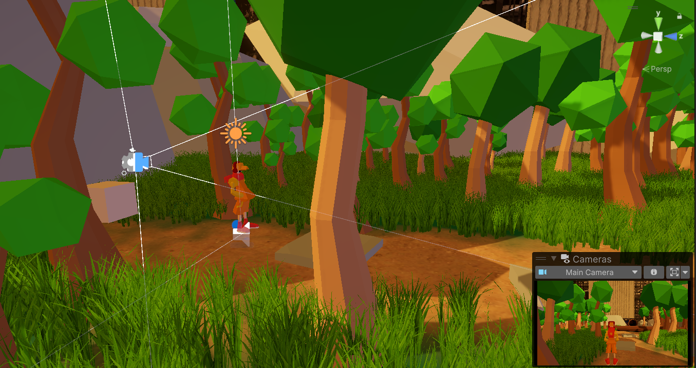
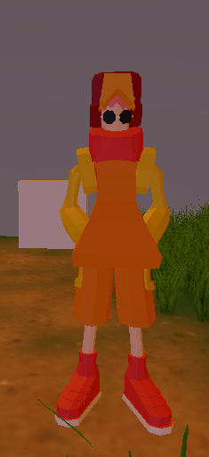
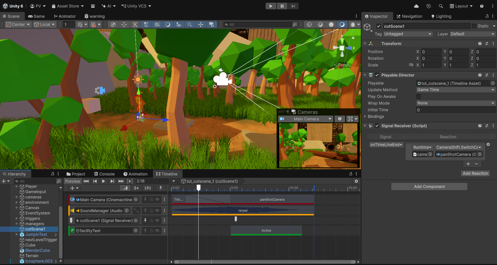

# Project Binary

This was a porject that i feel was a bit too ambitious. I had worked on the tutorial level of the game, but then slowly it became too glaring to finish it and i decided to make a more compact project. So this is more of a prototype to an adventure game i planned.

Things i learnt makng this :

1.Using the terrain system in unity -  
  
2. Making and importing a rigged character from blender into unity - 
  
3. Cutscenne managment - 
  
